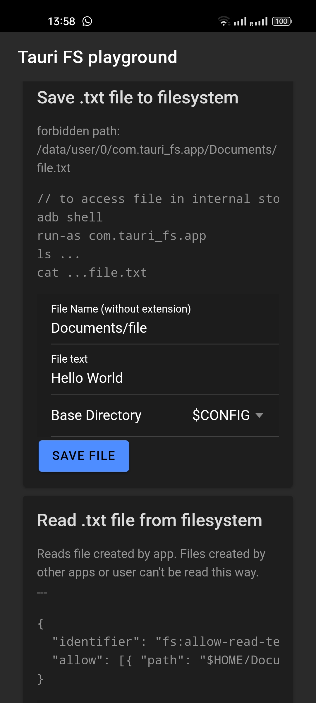

# Tauri-fs
Playground to test Tauri storage handling on Android.
Further information in article: https://philrich.dev/tauri-fs-android/




## Quick Start
Install dependencies:
```
pnpm install
```

Install `android-studio` on yor system: https://developer.android.com/studio
Install `ndk` within `android-studio`: Settings > Languages & Frameworks > SDK Tools

Set the `NDK_HOME`, `ANDROID_HOME` PATH variables (ANDROID_HOME is seen in Settings > Languages & Frameworks):
```
export ANDROID_HOME=YOUR_PATH/Android/sdk
export PATH=$ANDROID_HOME/cmdline-tools/latest/bin:$ANDROID_HOME/platform-tools:$PATH

export NDK_HOME=$ANDROID_HOME/ndk/29.0.13113456
export PATH=$PATH:$NDK_HOME
```

Initialize Android project:
```
pnpm tauri android init
```

Add permissions to android manifest: `./src-tauri/gen/android/app/src/main/AndroidManifest.xml`:

```diff
<manifest xmlns:android="http://schemas.android.com/apk/res/android">
    <uses-permission android:name="android.permission.INTERNET" />
+   <uses-permission android:name="android.permission.READ_EXTERNAL_STORAGE"/>
+   <uses-permission android:name="android.permission.WRITE_EXTERNAL_STORAGE" />
```
